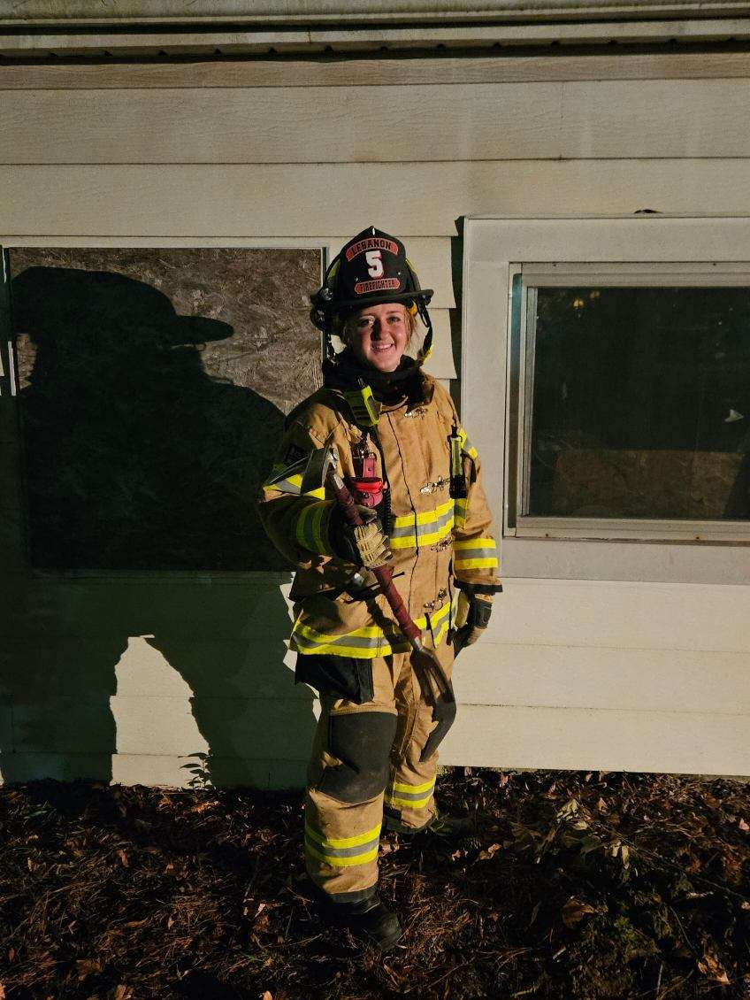
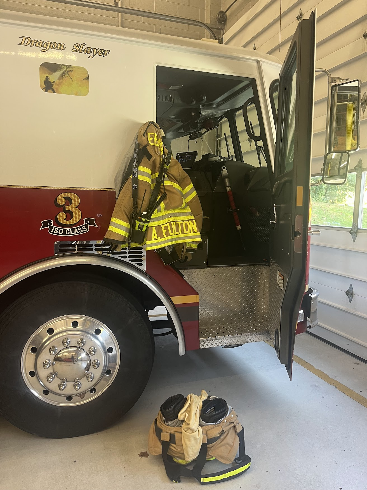
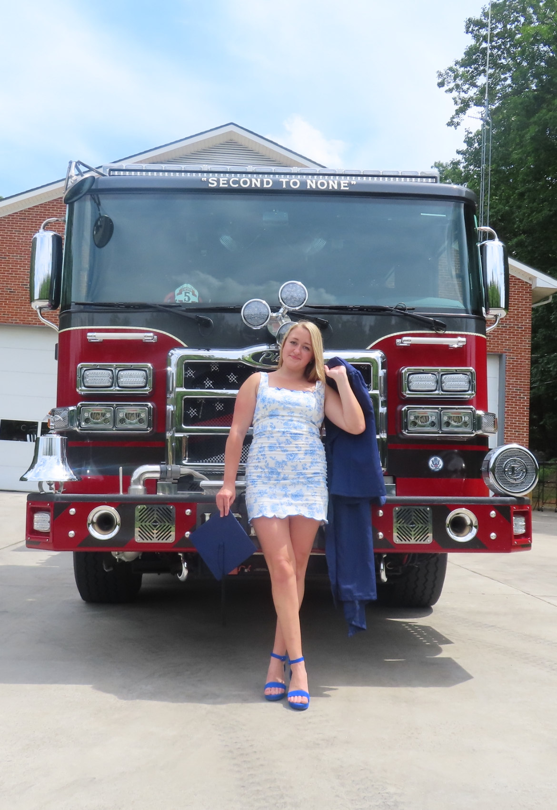

## Problem Addressed

- Firefighter fatalities (LODDs) are **largely preventable**
- Fire department leaders need **actionable guidance** to improve training and incident planning
- Existing data is scattered across large datasets and **not tailored to specific department characteristics** (personnel types, incident types, region, etc.), making it **inaccessible** to most fire leadership
- This product combines USFA fatality data with Census and FEMA context into **interpretable visuals** and **practical preparedness guidance.**

{.slide-icon}

## Live Demo / Walkthrough

Live demo link:

```text
https://connect.posit.cloud/amyfulton3/content/019d0762-ff21-8b3e-4699-26112368ec1d
```

{.slide-icon}

## Key Design Decisions & Trade-Offs

- **Fatalities, not injuries** volume of data vs. quality and standard reporting
- **Included disaster data** after noticing large fatality spikes around historical disasters
- **Formatting of graphs and charts** legible for 10 - 1,000 data points
- **Outputs structured into sections** for clarity & separate purposes
- **Simple models and interpretations** to make accessible for audience

{.slide-icon}

## What I Would Improve With More Time

- Consider incorporation of additional data sources (NFIRS/NERIS) for incident volume, civilian fatalities, etc.
- Expand validation of LLM outputs
- Add role-specific training plans
- Validate with more target users

{.slide-icon}

## Thank You

{height=450px}
{height=450px}
{height=450px}
